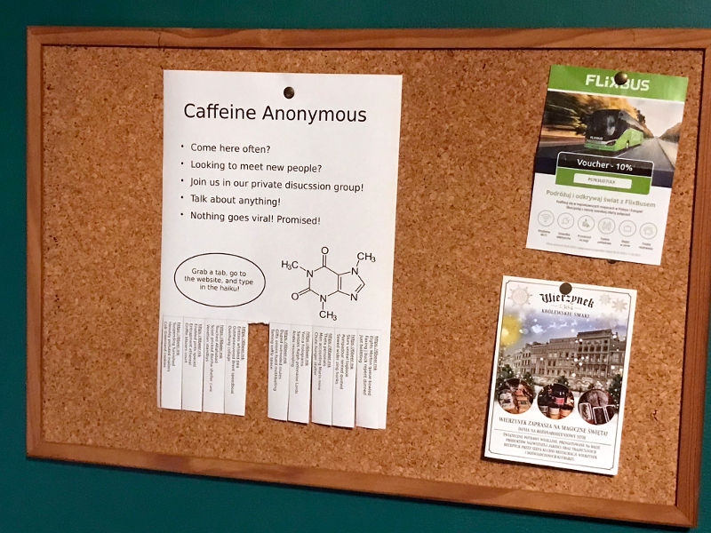
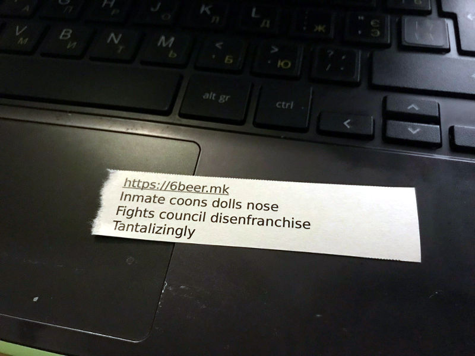

# 6bmk   


6bmk is an access control mechanism for Internet discussion boards. It consists of two parts:
a random haiku generator and a PowerPoint flyer generator. The haiku serve as a form of 
one-time code. Only people possessing a strip of paper torn from the flyer can join the 
group.





This project is inspired by bulletin board systems (BBSes) of yesteryears. Users of such 
systems generally all live in the same area code. This geographic proximity meant people
could easily meet up in the real world. And they did frequently, either at group events 
or visiting each other's homes. "Like a family" is not an uncommon description when 
people speak of their BBS experience. It's hope that by imposing a geographic limit on 
membership, we could recreate the old social dynamic on the Internet.

## Installation 

Node.js:
```sh
npm install 6bmk
```

PHP
```sh
composer require cleong/sixbeermk
```

PHP does not allow namespaces starting with digits. This is why a fuller name of the 
project is used.

## Usage - Node.js

### Generating haiku

```js
import { generateHaiku, normalizeHaiku } from '6bmk';
import { createHash } from 'crypto';

async function *getAccessHaiku(db, flyerId, locale) {
  // load existing haiku first
  const rows = await db.query(`SELECT text FROM haiku WHERE flyer_id = ?`, [ flyerId ]);
  for (const { text } of rows) {
    yield text;
  }
  // generate new ones if there aren't enough
  for await (const text of generateHaiku({ locale })) {
    // generate hash
    const sha1 = createHash('sha1');
    sha1.update(normalizeHaiku(text));
    const hash = sha1.digest('hex');
    // save to database
    db.query(`INSERT INTO haiku (flyer_id, text, hash) VALUES(?, ?, ?)`, [ flyerId, text, hash ]);
    yield text;
  }
}
```

[`generateHaiku`](./doc/generateHaiku.md#readme) returns an async generator. Generally you would 
save its output to a database so you can verify later that a user has entered a correct 
haiku. [`normalizeHaiku`](./doc/normalizeHaiku.md#readme) removes punctuations, normalizes
whitespaces, and converts characters to lowercase. These steps ensure we would get the 
same hash despite minor differences.

### Generating flyer

```js
import { createFlyer } from '6bmk';

async function createDownload(db, flyerId) {
  const [ row ] = await db.query(`SELECT address, instructions, options FROM flyer WHERE id = ?`, [ flyerId ]);
  const { address, instructions, options } = row;
  const { paper, orientation, mode, locale } = JSON.parse(options);
  const haiku = getAccessHaiku(db, flyerId, locale);
  return createFlyer({ paper, orientation, mode, address, instructions, haiku });
}
```

[`createFlyer`](./doc/createFlyer.md#readme) returns a Node 
[Readable Stream](https://nodejs.org/api/stream.html#readable-streams). If you're using 
[Fastify](https://www.fastify.io/), you can simply return the stream in your handler. 
If you're using [Express](https://expressjs.com/), you would need to pipe the stream 
into `res`. In both cases you should set the appriopriate HTTP headers so the response 
is handled as a download by the browser.

## Usage - PHP

### Generating haiku

```php
<?php

use cleong\sixbeermk\HaikuGenerator;

function get_access_haiku($db, $flyer_id, $locale) {
  // load existing haiku first
  $result = $db->query("SELECT text FROM haiku WHERE flyer_id = $flyer_id");
  $rows = $result->fetch_column();
  foreach ($rows as $text) {
    yield $text;
  }
  // generate new ones if there aren't enough
  $options = [ 'locale' => $locale ];
  foreach(HaikuGenerator::generate($options) as $text) {
    // generate hash
    $hash = sha1(HaikuGenerator::normalize($text));
    // save to database
    $stmt = $db->prepare("INSERT INTO haiku (flyer_id, text, hash) VALUES(?, ?, ?)");
    $stmt->bind_param("iss", $flyer_id, $text, $hash);
    $stmt->execute();
    yield $text;
  }
}
```

[`HaikuGenerator::generate`](./doc/HaikuGenerator.md#readme) returns a generator. 
Generally you would save its output to a database so you can verify later that a user 
has entered a correct haiku. 
[`HaikuGenerator::normalize`](./doc/HaikuGenerator.md#readme) removes punctuations, 
normalizes whitespaces, and converts characters to lowercase. These steps ensure we 
would get the same hash despite minor differences.

### Generating flyer

```php
<?php

use cleong\sixbeermk\FlyerGenerator;

function create_download($db, $flyer_id) {
  $result = $db->query("SELECT address, instructions, options FROM flyer WHERE id = $flyer_id");
  list(
    'address' => $address,
    'instructions' => $instructions,
    'options' => $options,
  ) = $result->fetch_assoc();
  $options = json_decode($options, true);
  $haiku = get_access_haiku($db, $flyer_id, $options['locale']);
  return FlyerGenerator::generate($options + [
    'address' => $address,
    'instructions' => $instructions,
    'haiku' => $haiku,
  ]);
}
```

[`FlyerGenerator::generate`](./doc/FlyerGenerator.md#readme) returns a stream.
Use [`fpassthru`](https://www.php.net/manual/en/function.fpassthru.php) to send 
the file content to the browser. You should set the appriopriate HTTP headers 
beforehand so that the response is handled as a download.
